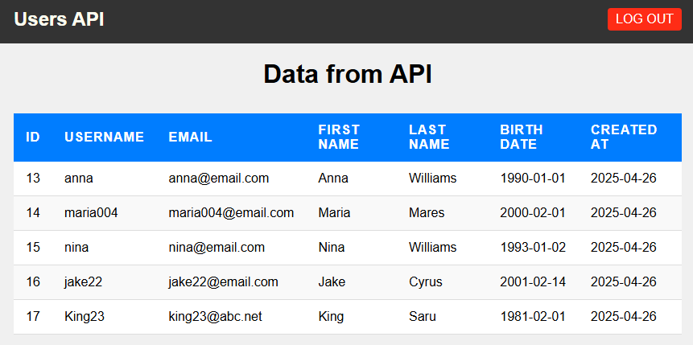

# PHP REST API Documentation

 <!-- Replace with actual screenshot if available -->

A simple PHP REST API implementation supporting basic CRUD operations.

## Base URL

https://localhost/php_rest_api/index.php/

### GET request

GET all users  
https://localhost/php_rest_api/index.php/

GET a single user  
https://localhost/php_rest_api/index.php/1

### POST request

REGISTER a new user  
https://localhost/php_rest_api/index.php/

### PUT request

UPDATE the info of the user
https://localhost/php_rest_api/index.php/1

### DELETE request

DELETE a user  
https://localhost/php_rest_api/index.php/1

### JWT Authentication 
Has Login System and implements JWT Authentication for GET requests
